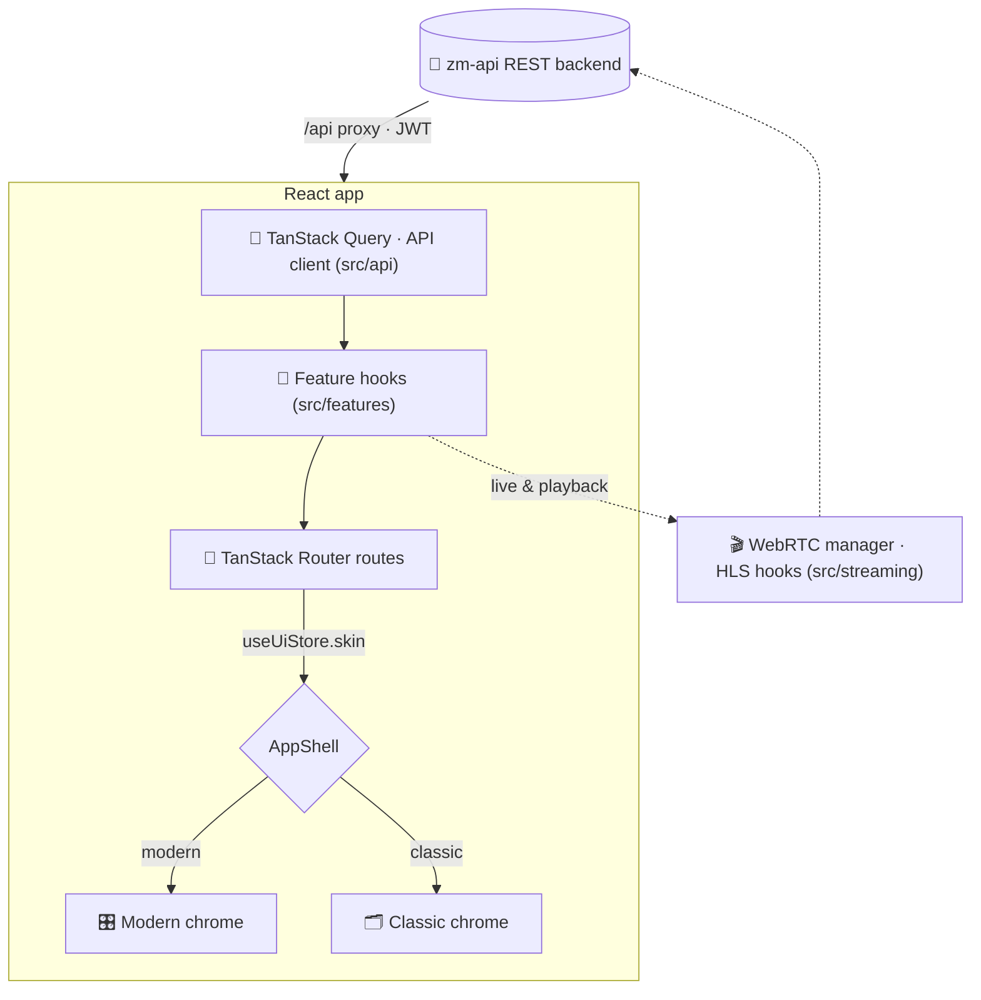

<div align="center">

# 🎛️ zm-web

### A modern, two-skin web UI for [ZoneMinder](https://zoneminder.com) surveillance systems

*ZoneMinder's web interface, rewritten: no PHP, one codebase, two skins —
a modern content-first console and a familiar classic layout — talking to
the [`zm-api`](https://github.com/SteveGilvarry/zm-api) Rust backend.*


[](LICENSE)


<br />

<table>
<tr>
<td width="50%"></td>
<td width="50%"></td>
</tr>
<tr>
<td align="center"><strong>🎛️ Modern</strong> — content-first ops console</td>
<td align="center"><strong>🗂️ Classic</strong> — legacy ZoneMinder look</td>
</tr>
</table>

<details>
<summary><strong>More of the interface</strong> — events, watch, montage, settings, light theme, classic events</summary>
<br />

<table>
<tr>
<td width="50%"></td>
<td width="50%"></td>
</tr>
<tr>
<td align="center">Events — the table is the page</td>
<td align="center">Watch — stage plus rail</td>
</tr>
<tr>
<td width="50%"></td>
<td width="50%"></td>
</tr>
<tr>
<td align="center">Montage — resizable mosaic</td>
<td align="center">Settings — configuration editor</td>
</tr>
<tr>
<td width="50%"></td>
<td width="50%"></td>
</tr>
<tr>
<td align="center">Light theme — designed, not inverted</td>
<td align="center">Classic events — the legacy layout</td>
</tr>
</table>

</details>

<sub>Camera images are blurred; the dev box watches a real house.
Regenerate with <code>npm run screenshots</code>. The sources are absolute
because GitHub does not rewrite relative <code>src</code> inside raw HTML —
it resolves against the page URL and 404s.</sub>

</div>

---

## ✨ Why zm-web?

ZoneMinder is a rock-solid surveillance platform, but its web UI is two decades of
Perl and PHP. **zm-web** is a clean React front end for the [`zm-api`](https://github.com/SteveGilvarry/zm-api)
REST backend — and it doesn't force a redesign on operators who don't want one:

- 🎨 **Two skins, one codebase** — switch between a content-first modern console and a classic ZoneMinder look at runtime.
- ⚡ **Fast & live** — WebRTC and HLS streaming, live thumbnails, snappy navigation.
- 🧩 **Heading for full parity** — every legacy page has a home (events, montage, filters, logs, reports, audit, settings), measured at ≈42% functional parity on 2026-08-21. The plan to 1.0 is in [`docs/PRODUCTION-READINESS-PLAN.md`](docs/PRODUCTION-READINESS-PLAN.md).
- 🔒 **Auth-aware** — JWT auth, token-scoped media, capability-gated controls (PTZ, system start/stop).
- 🧪 **Tested** — Vitest unit suite + Playwright e2e across Chromium and WebKit.

---

## 🖥️ The two skins

| | **Modern** | **Classic ZoneMinder** |
|---|---|---|
| **Feel** | Near-monochrome chrome; the video is the only saturated thing on screen, and colour means state — alarm, recording, offline — never decoration | Legacy-style top nav + dense white tables |
| **For** | Everyday operation and wall displays | Operators migrating from the PHP UI |
| **Layout** | A fixed frame: one dense line of chrome, content owning the rest. The console *is* the camera wall | Top nav + tabular rows |
| **Themes** | Dark and light, both designed rather than inverted | Light only, as the original is |

The modern skin's standard is [`docs/DESIGN.md`](docs/DESIGN.md); the classic skin is judged
against ZoneMinder 1.39 instead, quirks included.

Selection lives in a persisted Zustand store and is honoured by `<AppShell>`. A `?skin=modern|classic`
URL hint switches once; operators also pick in **Settings → Appearance**. Every route renders the same
data through shared hooks — only the layout primitives differ.

---

## 🚀 Features

### 📹 Live View & Watch
Per-monitor live streaming over **WebRTC** (low latency) or **HLS**, with an integrated **PTZ**
control surface — D-pad, speed/zoom/focus rockers, presets, and AUTO state — capability-gated
against each monitor. Pinch or drag to zoom the received picture without moving the camera, and
a volume control for streams that carry audio. Portrait cameras are fitted to the frame, not the
column width.

### 🎬 Events & Playback
Browse, filter, and replay recorded events with **codec-aware playback**: progressive MP4 for
H.264 (plays everywhere, byte-range seeking), HLS for HEVC, and a graceful download fallback for
codecs the browser can't decode. Plus a per-frame scrubber, tags, notes, and Tot/Avg/Max scores.

### 🧱 Montage & Review
Multi-camera grids, and a **Montage Review** with a synchronized master clock and per-monitor
event bars on a draggable timeline. Plus a **Cycle** auto-rotating single-camera view.

### 📊 Operations parity
**Console** status (panels or classic table), **Groups**, a rule-row **Filters** builder with
auto-archive / auto-delete, **Logs** (level + component filters), **Reports**, and **Audit**.

### ⚙️ Settings & System
Config editor, clustering **servers**, **storage**, **users** and **run state**. Machine
readings — load, CPU, memory, disk, per-daemon health — live on the console's status line, one
click from the running indicator, rather than in a strip above every page.

---

## 🏗️ Architecture

One data layer, two layouts — routes are six-line lookups that render the active skin's page,
both fed by the same skin-agnostic feature hooks.



| Layer | Path | Responsibility |
|------|------|----------------|
| **API** | `src/api/` | Typed REST client + per-resource endpoint wrappers |
| **Features** | `src/features/` | Skin-agnostic data hooks & headless logic |
| **Routes** | `src/routes/` | File-based routes; dispatch on the active skin |
| **Skins** | `src/skins/` | `AppShell` + modern / classic chrome |
| **Streaming** | `src/streaming/` | WebRTC manager + HLS playback hooks |
| **Stores** | `src/stores/` | Zustand state (auth, UI) |

---

## 🧰 Tech Stack

| | |
|---|---|
| **Framework** | [React 19](https://react.dev) + [Vite 7](https://vite.dev) + TypeScript |
| **Routing** | [TanStack Router](https://tanstack.com/router) (file-based) |
| **Data** | [TanStack Query](https://tanstack.com/query) |
| **State** | [Zustand](https://github.com/pmndrs/zustand) |
| **Styling** | [Tailwind CSS v4](https://tailwindcss.com) |
| **Streaming** | [hls.js](https://github.com/video-dev/hls.js) + native WebRTC |
| **Testing** | [Vitest](https://vitest.dev) + Testing Library · [Playwright](https://playwright.dev) |

---

## 🚀 Quick Start

### Prerequisites

- **Node.js 20+** (developed on Node 24) — install via [nvm](https://github.com/nvm-sh/nvm) or [the installer](https://nodejs.org)
- A running [`zm-api`](https://github.com/SteveGilvarry/zm-api) backend reachable from your machine

```bash
# 1. Clone
git clone https://github.com/SteveGilvarry/zm-web.git
cd zm-web

# 2. Install
npm install

# 3. Point at your backend (gitignored .env)
cp .env.example .env
#   then set VITE_API_PROXY_TARGET=http://your-zm-api-host:8080

# 4. Run
npm run dev                        # http://localhost:5173
```

The Vite dev server proxies `/api` (and WebSocket upgrades) to `VITE_API_PROXY_TARGET`,
defaulting to `http://localhost:8080` when unset.

---

## 📜 Scripts

| Command | Description |
|---|---|
| `npm run dev` | Start the dev server with the `/api` proxy |
| `npm run build` | Type-check (`tsc -b`) and build for production |
| `npm run preview` | Preview the production build |
| `npm run lint` | Run ESLint |
| `npm test` | Run the unit suite once (Vitest) |
| `npm run test:watch` | Vitest in watch mode |
| `npm run test:ui` | Vitest interactive UI |
| `npm run test:coverage` | Coverage, then the per-file floor (`scripts/coverage-floor.mjs`) |
| `npm run test:e2e` | Playwright against a live backend (`:webkit` / `:chromium` for one browser) |
| `npm run test:e2e:seeded` | Playwright against the hermetic seeded stack — see below |
| `npm run i18n:check` | Fail if any string is missing from the catalogue (CI gate) |
| `npm run screenshots` | Regenerate the README images from a running dev server |

**The seeded suite** is the one to run before a PR: it stands up ZoneMinder's schema in Docker,
loads fixed rows, and runs both skins against a real `zm-api` — no dev box needed.

```bash
npm run e2e:seed:up          # MariaDB + schema + seed on :3308
npm run e2e:seed:api         # zm-api against it, on :8089 (foreground)
npm run test:e2e:seeded      # in another shell
npm run e2e:seed:down        # when finished
```

Node is pinned by `.nvmrc` (22). CI honours it, and a different major has
[bitten us](https://github.com/SteveGilvarry/zm-web/pull/2) — `nvm use` before running the suite.

---

## 📦 Production deployment

`npm run build` writes a static site to `dist/`. Serving it needs an SPA fallback
(deep links such as `/events/123` must return `index.html`), a reverse proxy from
`/api/` to `zm-api` that forwards WebSocket upgrades (WebRTC signaling lives on
`/api/v3/live/{id}/webrtc/ws` and the socket stays open while you watch), and TLS,
because browsers refuse WebRTC on plain `http://` away from `localhost`.
Full detail, including the CSP, is in [`docs/DEPLOYMENT.md`](docs/DEPLOYMENT.md).

**Container** (nginx, multi-stage build, renders its config from env on start):

```bash
docker build -t zm-web .
docker run -d -p 8080:8080 -e ZM_API_URL=http://zm-api-host:8080 zm-web
# or: ZM_API_URL=http://zm-api-host:8080 docker compose up -d   (add --profile tls for https on :8443)
```

| Variable | When | Default | What it does |
|---|---|---|---|
| `ZM_API_URL` | run | required | Upstream `zm-api` the container proxies `/api/` to. |
| `ZM_API_BASE` | run | `/api/v3` | Prefix the browser calls; written to `/config.js`. Set to an absolute URL only if the API is on another origin (CORS on `zm-api` required). |
| `VITE_BASE` | build | `/` | Sub-path to serve from, e.g. `/zm/`. |

**Bare nginx or Caddy.** Copy `dist/` to the server and use
[`docker/nginx.conf.template`](docker/nginx.conf.template) (with `proxy.conf` and
`headers.conf`) or [`docker/Caddyfile`](docker/Caddyfile). Caddy handles certificates
itself; for nginx bring your own or put the container behind a TLS terminator you
already run.

**WebRTC across NAT.** The client offers Google's public STUN servers
(`src/streaming/webrtcManager.ts`). On a LAN they are never used. For remote
operators behind NAT run your own TURN (coturn) and edit that list; HLS remains
available as the fallback. **Air-gapped:** fonts are bundled (`public/fonts/`), the
app makes no other off-origin request, and unreachable STUN hosts only delay ICE.

### Browsers

| Browser | Live view | Notes |
|---|---|---|
| Chrome / Edge 111+ | WebRTC, HLS via `hls.js` | Primary target; the CI e2e suite runs here |
| Firefox 115+ | WebRTC, HLS via `hls.js` | |
| Safari 16.4+ (macOS) | WebRTC, **native** HLS | Needs H.264 `42e01f`/`640c1f` in the offer; the suite runs on WebKit |
| iOS Safari 16.4+ | WebRTC, native HLS | 390 px layout is asserted in CI; fullscreen uses the iOS video API |

Everything below that is untested, and anything without WebRTC or MSE will not
show live video. The UI itself needs a browser with CSS nesting and
`:has()` — the same 2023 baseline.

---

## 📁 Project Layout

```
src/
├── api/         Typed REST client & per-resource endpoint wrappers
├── components/  common/ (Panel, …) · console/ · layout/
├── features/    Skin-agnostic data hooks + headless logic per feature
├── routes/      TanStack Router file-based routes (dispatch on skin)
├── skins/       AppShell + modern/ and classic/ chrome
├── streaming/   WebRTC manager + HLS playback hooks
├── stores/      Zustand stores (auth, UI)
├── types/       Shared TypeScript interfaces + helpers
└── index.css    Tailwind v4 theme & utilities
```

See [`CLAUDE.md`](./CLAUDE.md) for deeper architecture notes — the dual-skin design,
API response conventions, and streaming internals.

---

## 🔌 API conventions

A few `zm-api` quirks worth knowing (full details in [`CLAUDE.md`](./CLAUDE.md)):

- 📄 **Paginated** responses use `{ items, total, per_page, current_page, last_page }`.
- 🔢 **Booleans** come back as integers (`0 | 1`) — use the `toBool()` helper.
- 🗓️ **Dates** are snake_case (`start_date_time`, `end_date_time`).
- 🔒 **Live endpoints** require a JWT via `Authorization: Bearer` or a raw `?token=` query param
  (WebSockets must use `?token=` — browsers can't set headers on `new WebSocket()`).

---

## 🔗 Related projects

- 🦀 **[zm-api](https://github.com/SteveGilvarry/zm-api)** — the Rust REST API backend this dashboard consumes.

---

## 🤝 Contributing

PRs welcome! Before opening one, run the quality gates:

```bash
npm run lint && npm test && npm run build
```

Keep changes focused, work tests-first, and make sure features work in **both skins**. Full
workflow and conventions are in [`CONTRIBUTING.md`](CONTRIBUTING.md); contributions are
covered by the [CLA](CLA.md).

---

## 📄 License

zm-web is **dual-licensed**:

- 🆓 **Open source — [AGPL-3.0](LICENSE).** Free to use, modify, and self-host. If you
  run a modified version as a network service, the AGPL requires you to publish your
  changes — the same license as the [`zm-api`](https://github.com/SteveGilvarry/zm-api) backend.
- 💼 **Commercial license.** For embedding zm-web in a closed-source product, or running a
  modified version as a hosted service without the AGPL's source-sharing obligation, a
  commercial license is available. Contact the maintainer to enquire.

Contributions are accepted under a [Contributor License Agreement](CLA.md) so the project can be
offered under both licenses — see [`CONTRIBUTING.md`](CONTRIBUTING.md).

---

<div align="center">
<sub>Built for the ZoneMinder community. 🎥</sub>
</div>
