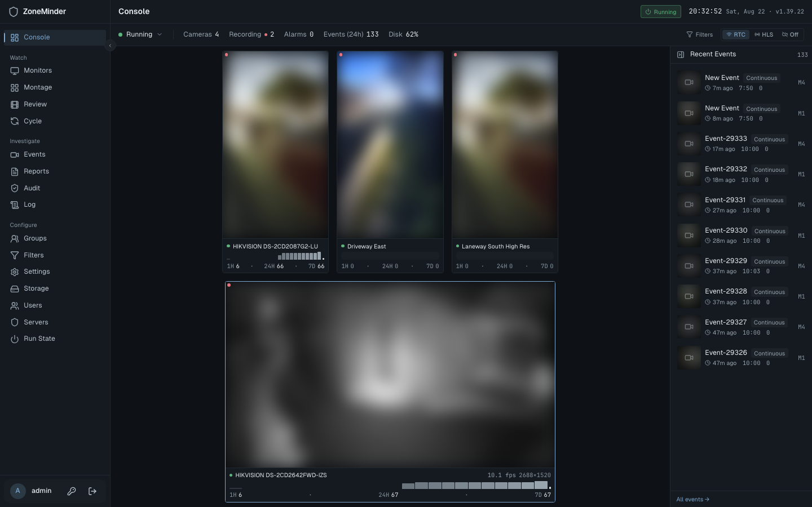
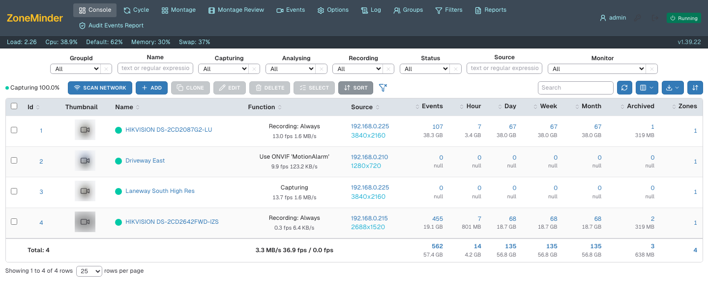
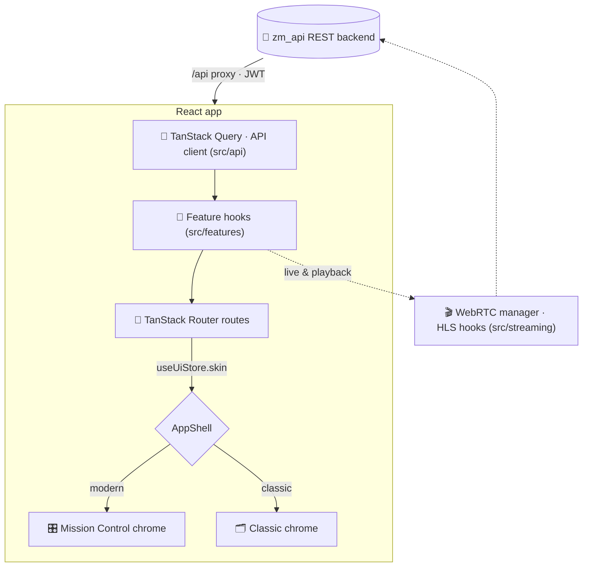

<div align="center">

# 🎛️ zm-dashboard

### A modern, two-skin web UI for [ZoneMinder](https://zoneminder.com) surveillance systems

*Replacing ZoneMinder's aging PHP web interface with a fast React dashboard —
one codebase that ships both an opinionated "Mission Control" theme and a
familiar classic skin, powered by the [`zm_api`](https://github.com/SteveGilvarry/zm-api) Rust backend.*


[](LICENSE)


<br />

<table>
<tr>
<td width="50%"></td>
<td width="50%"></td>
</tr>
<tr>
<td align="center"><strong>🎛️ Mission Control</strong> — modern dark dashboard</td>
<td align="center"><strong>🗂️ Classic</strong> — legacy ZoneMinder look</td>
</tr>
</table>

</div>

---

## ✨ Why zm-dashboard?

ZoneMinder is a rock-solid surveillance platform, but its web UI is two decades of
Perl and PHP. **zm-dashboard** is a clean React front end for the [`zm_api`](https://github.com/SteveGilvarry/zm-api)
REST backend — and it doesn't force a redesign on operators who don't want one:

- 🎨 **Two skins, one codebase** — switch between a modern dashboard and a classic ZoneMinder look at runtime.
- ⚡ **Fast & live** — WebRTC and HLS streaming, live thumbnails, snappy navigation.
- 🧩 **Feature-complete** — full parity with the legacy UI: events, montage, filters, logs, reports, audit, settings.
- 🔒 **Auth-aware** — JWT auth, token-scoped media, capability-gated controls (PTZ, system start/stop).
- 🧪 **Tested** — Vitest unit suite + Playwright e2e across Chromium and WebKit.

---

## 🖥️ The two skins

| | **Mission Control** | **Classic ZoneMinder** |
|---|---|---|
| **Feel** | Dark "command center" — cyan accents, panels, glow | Legacy-style top nav + dense white tables |
| **For** | New users, wall displays, adaptive layouts | Operators migrating from the PHP UI |
| **Layout** | Sidebar + panel grids, live thumbnails | Top nav + tabular rows |

Selection lives in a persisted Zustand store and is honoured by `<AppShell>`. A `?skin=modern|classic`
URL hint switches once; operators also pick in **Settings → Appearance**. Every route renders the same
data through shared hooks — only the layout primitives differ.

---

## 🚀 Features

### 📹 Live View & Watch
Per-monitor live streaming over **WebRTC** (low latency) or **HLS**, with an integrated **PTZ**
control surface — D-pad, speed/zoom/focus rockers, presets, and AUTO state — capability-gated
against each monitor.

### 🎬 Events & Playback
Browse, filter, and replay recorded events with **codec-aware playback**: progressive MP4 for
H.264 (plays everywhere, byte-range seeking), HLS for HEVC, and a graceful download fallback for
codecs the browser can't decode. Plus a per-frame scrubber, tags, notes, and Tot/Avg/Max scores.

### 🧱 Montage & Review
Multi-camera grids, and a **Montage Review** with a synchronized master clock and per-monitor
event bars on a draggable timeline. Plus a **Cycle** auto-rotating single-camera view.

### 📊 Operations parity
**Console** status (panels or classic table), **Groups**, a rule-row **Filters** builder with
auto-archive / auto-delete, **Logs** (level + component filters), **Reports**, and **Audit**.

### ⚙️ Settings & System
Config editor, API **tokens/sessions**, clustering **servers**, and a header status strip
(LOAD/CPU/MEM/DISK with warn thresholds) plus a RUNNING toggle wired to system startup/shutdown.

---

## 🏗️ Architecture

One data layer, two layouts — routes dispatch on the active skin and render either modern panels
or classic tables, both fed by the same skin-agnostic feature hooks.



| Layer | Path | Responsibility |
|------|------|----------------|
| **API** | `src/api/` | Typed REST client + per-resource endpoint wrappers |
| **Features** | `src/features/` | Skin-agnostic data hooks & headless logic |
| **Routes** | `src/routes/` | File-based routes; dispatch on the active skin |
| **Skins** | `src/skins/` | `AppShell` + modern / classic chrome |
| **Streaming** | `src/streaming/` | WebRTC manager + HLS playback hooks |
| **Stores** | `src/stores/` | Zustand state (auth, UI) |

---

## 🧰 Tech Stack

| | |
|---|---|
| **Framework** | [React 19](https://react.dev) + [Vite 7](https://vite.dev) + TypeScript |
| **Routing** | [TanStack Router](https://tanstack.com/router) (file-based) |
| **Data** | [TanStack Query](https://tanstack.com/query) |
| **State** | [Zustand](https://github.com/pmndrs/zustand) |
| **Styling** | [Tailwind CSS v4](https://tailwindcss.com) |
| **Streaming** | [hls.js](https://github.com/video-dev/hls.js) + native WebRTC |
| **Testing** | [Vitest](https://vitest.dev) + Testing Library · [Playwright](https://playwright.dev) |

---

## 🚀 Quick Start

### Prerequisites

- **Node.js 20+** (developed on Node 24) — install via [nvm](https://github.com/nvm-sh/nvm) or [the installer](https://nodejs.org)
- A running [`zm_api`](https://github.com/SteveGilvarry/zm-api) backend reachable from your machine

```bash
# 1. Clone
git clone https://github.com/SteveGilvarry/zm-dashboard.git
cd zm-dashboard

# 2. Install
npm install

# 3. Point at your backend (gitignored .env)
cp .env.example .env
#   then set VITE_API_PROXY_TARGET=http://your-zm-api-host:8080

# 4. Run
npm run dev                        # http://localhost:5173
```

The Vite dev server proxies `/api` (and WebSocket upgrades) to `VITE_API_PROXY_TARGET`,
defaulting to `http://localhost:8080` when unset.

---

## 📜 Scripts

| Command | Description |
|---|---|
| `npm run dev` | Start the dev server with the `/api` proxy |
| `npm run build` | Type-check (`tsc -b`) and build for production |
| `npm run preview` | Preview the production build |
| `npm run lint` | Run ESLint |
| `npm test` | Run the unit suite once (Vitest) |
| `npm run test:watch` | Vitest in watch mode |
| `npm run test:ui` | Vitest interactive UI |
| `npm run test:e2e` | Run Playwright e2e tests (`:webkit` / `:chromium` for one browser) |

---

## 📁 Project Layout

```
src/
├── api/         Typed REST client & per-resource endpoint wrappers
├── components/  common/ (Panel, …) · console/ · layout/
├── features/    Skin-agnostic data hooks + headless logic per feature
├── routes/      TanStack Router file-based routes (dispatch on skin)
├── skins/       AppShell + modern/ and classic/ chrome
├── streaming/   WebRTC manager + HLS playback hooks
├── stores/      Zustand stores (auth, UI)
├── types/       Shared TypeScript interfaces + helpers
└── index.css    Tailwind v4 theme & utilities
```

See [`CLAUDE.md`](./CLAUDE.md) for deeper architecture notes — the dual-skin design,
API response conventions, and streaming internals.

---

## 🔌 API conventions

A few `zm_api` quirks worth knowing (full details in [`CLAUDE.md`](./CLAUDE.md)):

- 📄 **Paginated** responses use `{ items, total, per_page, current_page, last_page }`.
- 🔢 **Booleans** come back as integers (`0 | 1`) — use the `toBool()` helper.
- 🗓️ **Dates** are snake_case (`start_date_time`, `end_date_time`).
- 🔒 **Live endpoints** require a JWT via `Authorization: Bearer` or a raw `?token=` query param
  (WebSockets must use `?token=` — browsers can't set headers on `new WebSocket()`).

---

## 🔗 Related projects

- 🦀 **[zm_api](https://github.com/SteveGilvarry/zm-api)** — the Rust REST API backend this dashboard consumes.

---

## 🤝 Contributing

PRs welcome! Before opening one, run the quality gates:

```bash
npm run lint && npm test && npm run build
```

Keep changes focused, work tests-first, and make sure features work in **both skins**. Full
workflow and conventions are in [`CONTRIBUTING.md`](CONTRIBUTING.md); contributions are
covered by the [CLA](CLA.md).

---

## 📄 License

zm-dashboard is **dual-licensed**:

- 🆓 **Open source — [AGPL-3.0](LICENSE).** Free to use, modify, and self-host. If you
  run a modified version as a network service, the AGPL requires you to publish your
  changes — the same license as the [`zm_api`](https://github.com/SteveGilvarry/zm-api) backend.
- 💼 **Commercial license.** For embedding zm-dashboard in a closed-source product, or running a
  modified version as a hosted service without the AGPL's source-sharing obligation, a
  commercial license is available. Contact the maintainer to enquire.

Contributions are accepted under a [Contributor License Agreement](CLA.md) so the project can be
offered under both licenses — see [`CONTRIBUTING.md`](CONTRIBUTING.md).

---

<div align="center">
<sub>Built for the ZoneMinder community. 🎥</sub>
</div>
